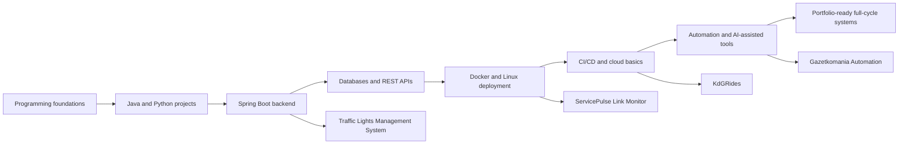
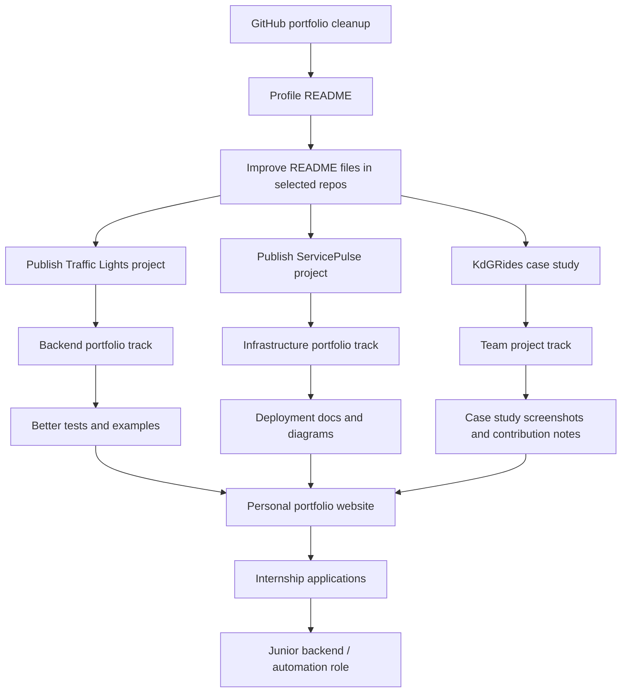
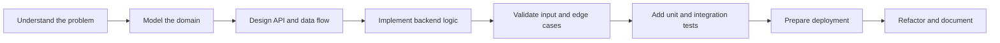

<!-- README.md for GitHub profile repository: Nister37/Nister37 -->

# Paweł Ryfiak

### Applied Computer Science Student | Java / Spring Backend | Automation | Docker & Linux

<h3>
  “The more one succeeds in building complex systems that work, 
  the stronger the hunger for knowledge, experience, and self-improvement becomes.”
</h3>

<b>Build • Test • Deploy • Learn • Improve</b>

---

I build practical software systems with a strong focus on backend development, automation, data processing, infrastructure basics and maintainable project structure.

---

## About me

I am a second-year **Applied Computer Science** student at **Karel de Grote Hogeschool** in Antwerp, with a background as a **Technician Programmer** from Poland.

My path started with programming fundamentals, C++ and school projects, then moved into Java, Python automation, databases, web applications and infrastructure. Over time, I became most interested in systems that solve real operational problems: backend applications, data-processing tools, automation pipelines, integrations with external APIs and deployment workflows.

At the moment, I focus mainly on:

* **Java / Spring Boot backend development**
* **PostgreSQL / SQL data modeling and persistence**
* **REST APIs, validation, testing and layered architecture**
* **Docker, Linux, reverse proxy and basic cloud deployment**
* **Python automation, Selenium, PyAutoGUI and AI-assisted workflows**

I like projects where software connects multiple layers: business logic, database, external API, infrastructure and a clear user-facing result.

---

## Current direction

---

## Tech stack

### Backend and application development

### Databases and data

### DevOps, infrastructure and tooling

### Automation, frontend and other areas

---

## Technology timeline

This timeline shows approximate active-use periods, not strict employment experience.

| Area                           | Approx. active period | Typical use                                                                                |
| ------------------------------ | --------------------: | ------------------------------------------------------------------------------------------ |
| C++ / programming fundamentals |             2019–2021 | First programming steps, school foundations, algorithms and basic desktop/console projects |
| C# / Windows Forms basics      |             2021–2022 | School and desktop application foundations                                                 |
| HTML / CSS                     |          2020–present | Web pages, layouts, college projects, client website maintenance                           |
| Python                         |          2022–present | Automation, scripting, Selenium, PyAutoGUI, data-processing tools                          |
| SQL / relational databases     |          2021–present | PostgreSQL, MySQL, DDL/DML, data corrections, persistence in apps                          |
| Java                           |          2024–present | College projects, backend foundations, object-oriented design                              |
| Linux / server basics          |          2024–present | Workstations, Debian/Proxmox experiments, deployment environments                          |
| JavaScript                     |          2022–present | Web UI basics, frontend behavior, college projects                                         |
| Spring Boot ecosystem          |          2025–present | REST APIs, JPA, validation, layered backend architecture, tests                            |
| Docker / Docker Compose        |          2025–present | Local environments, backend deployment, database containers, reverse proxy stacks          |
| CI/CD and cloud basics         |          2025–present | GitLab CI, GitHub Actions, Google Cloud VM deployments                                     |
| AI-assisted automation         |          2024–present | Gemini/API integrations, OCR/data extraction workflows, automation tooling                 |

---

## Selected projects

| Project                              | Type                                      | Main stack                                                                                             | What it demonstrates                                                                                    |
| ------------------------------------ | ----------------------------------------- | ------------------------------------------------------------------------------------------------------ | ------------------------------------------------------------------------------------------------------- |
| **KdGRides**                         | Team web application                      | Java, Spring Boot, PostgreSQL, Docker, GitLab CI/CD, OAuth2/OIDC, WebSocket/STOMP, Google Calendar API | Real-time communication, backend testing, infrastructure scripts, external API integration and teamwork |
| **Traffic Lights Management System** | Individual academic project               | Java, Spring Boot, Spring MVC, Spring Data JPA, PostgreSQL, Thymeleaf, Spring Security, JUnit          | Layered Spring application, CRUD, validation, persistence, security basics and testing                  |
| **ServicePulse Link Monitor**        | Individual infrastructure-focused project | Spring Boot, PostgreSQL, Docker Compose, Caddy, Linux, GCP                                             | Full-cycle backend plus deployment: app, database, reverse proxy, HTTPS and server setup                |
| **Roometrix**                        | IoT / web concept                         | Spring Boot, PostgreSQL, IoT sensors, dashboards                                                       | Indoor air-quality monitoring concept combining backend, data and hardware-oriented thinking            |
| **Rainsnow**                         | Python utility                            | Python, weather data, desktop notifications                                                            | Small practical automation tool for rainfall/snowfall notifications                                     |

---

## Project roadmap

---

## How I usually approach projects

I prefer systems that are explainable: clear responsibilities, predictable data flow, explicit validation and a deployment path that can be reproduced.

---

## What I am working on now

* Preparing a cleaner GitHub portfolio around backend, automation and infrastructure projects
* Building a personal portfolio website with Astro, Svelte, Tailwind, Sass, daisyUI, Bun and GitHub Pages
* Improving Spring Boot project structure, testing habits and documentation quality
* Learning more about CI/CD, deployment reliability, reverse proxies, Linux servers and cloud basics
* Exploring practical AI-assisted automation with OCR, LLM APIs and local developer tooling

---

## Coding practice

I use **LeetCode** to keep improving algorithmic thinking, problem decomposition and coding interview fundamentals.

---

## Professional interests

* Backend engineering with Java and Spring Boot
* REST APIs, data validation and maintainable service-layer logic
* PostgreSQL, database modeling and SQL performance basics
* Docker-based deployment and Linux server environments
* CI/CD pipelines and deployment automation
* Python automation for repetitive workflows
* AI-assisted tools that solve practical business problems
* IoT and embedded prototypes when they connect to real software systems

---

## GitHub profile plan

Pinned repositories should represent the current direction, not every old learning exercise.

| Priority | Repository idea                        | Purpose                                                                                      |
| -------: | -------------------------------------- | -------------------------------------------------------------------------------------------- |
|        1 | `kdgrides-case-study`                  | Main team-project case study with selected contributions, screenshots and architecture notes |
|        2 | `traffic-lights-management-system`     | Main Spring Boot / Java backend project                                                      |
|        3 | `servicepulse-link-monitor`            | Backend + Docker + deployment project                                                        |
|        4 | `portfolio-website`                    | Modern personal website built with Astro/Svelte/Tailwind                                     |
|        5 | `rainsnow` or selected utility project | Small practical Python automation project                                                    |

---

## Contact

* GitHub: [github.com/Nister37](https://github.com/Nister37)
* LinkedIn: [linkedin.com/in/pawel-ryfiak-029889242](https://www.linkedin.com/in/pawel-ryfiak-029889242/)

---
